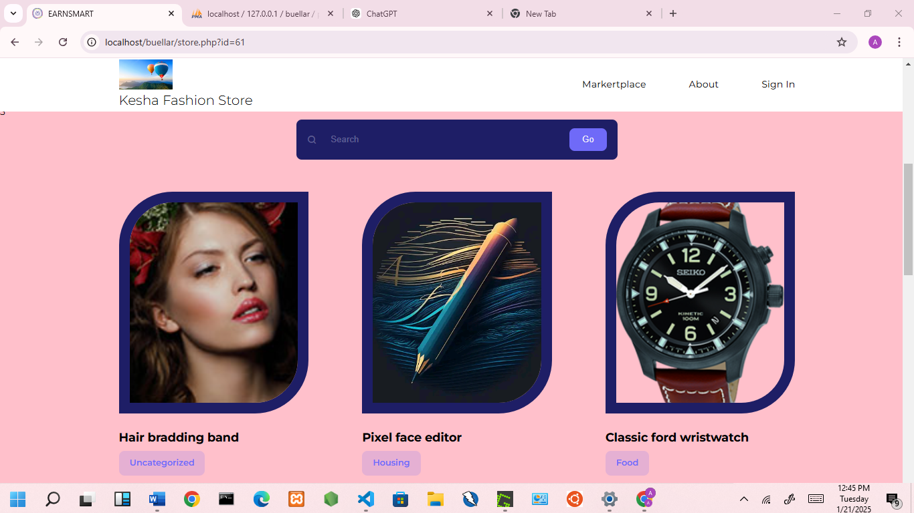
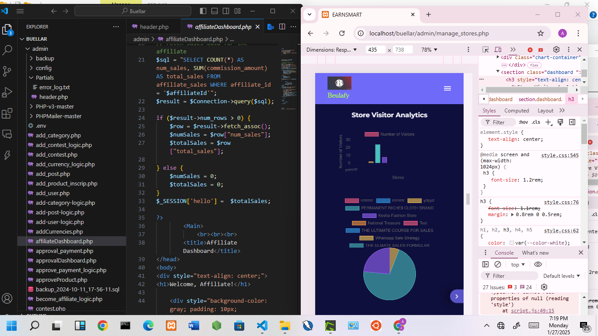
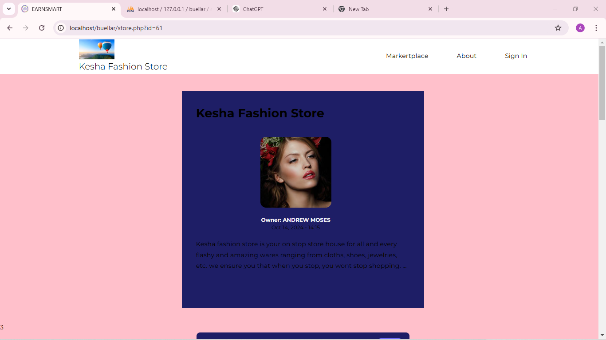
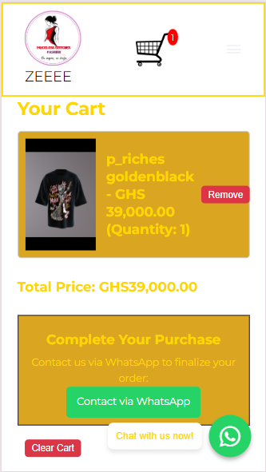

# Beulafy 🌸

  

**Beulafy** is a web-based platform inspired by the meaning of *Beulah* — something cherished, beautiful, and blessed.  
It enables users to create **beautiful websites and templates**, similar in vision to Shopify, with flexibility for creators, educators, and small businesses.

---

## 🚀 Project Background
Beulafy has been under continuous development since **2023** as a long-term personal project focused on:
- Clean and modern web development practices
- Scalable and modular architecture
- User-friendly design
- Secure and reliable systems

The platform was first publicly launched in **February 2025** under the domain **Beulafy.co** and is currently undergoing major updates and feature expansion.

---

## 🏪 How the Store Works
Beulafy stores are designed for seamless interaction and commerce:
1. **Store Creation:** Users answer simple questions, and Beulafy generates a functional store automatically.  
2. **Browsing Products:** Visitors can navigate the store, view product/article cards, and explore available items.  
3. **Purchase Options:** Users can either:
   - Purchase directly within the store (if enabled)  
   - Or go to a **WhatsApp page** for direct communication with the seller.  
4. **WhatsApp Integration:** Every store generates a WhatsApp link so buyers can chat, ask questions, or confirm purchases.  
5. **Contact If Code Not Available:**  
   

   <a href="mailto:andrewmoses@example.com">
     <button style="padding:10px 20px; border:none; background-color:#FF69B4; color:white; border-radius:8px; cursor:pointer;">
       Contact Developer
     </button>
   </a>
   

---

## 🖼️ Project Evolution

### 🔹 Logo

  

---

### 🔹 Early Design (Old Stores)

  

   
  

  
  

> Initial layout and structure during the early development stage.

---

### 🔹 New Design Update (Stores)

  

  
  

> Improved UI/UX, cleaner layout, better user experience, and enhanced store interaction.

---

### 🔹 Ongoing Development

  

> Active development phase focusing on:
- Automated store creation from simple Q&A
- Performance improvements
- New feature integration
- Enhanced security and user experience

---

## 🎯 Core Features
- User registration and secure authentication
- Website and template creation system
- Media and content uploads
- Customizable layouts
- Admin and user dashboards
- Store creation and management
- WhatsApp integration for direct communication
- Secure backend logic and validations

---

## 🛠️ Tech Stack
- **Frontend:** HTML, CSS, JavaScript  
- **Backend:** PHP  
- **Database:** MySQL  
- **Version Control:** Git & GitHub  

---

## 🔐 Security Focus
- Input validation and sanitization
- Secure authentication workflows
- Prepared SQL statements
- Gradual integration of security testing and SOC principles

---

## 📈 Vision & Roadmap
- Enhanced UI/UX and accessibility
- Expansion of the template marketplace
- Subscription-based features
- Advanced security monitoring
- Public beta release preparation

---

## 👨‍💻 Creator

  

**Andrew Moses**  
Founder & Developer of Beulafy  
Web Developer | Cybersecurity Enthusiast  

> *Beulafy is a passion project combining creativity, technology, and secure digital innovation.*
